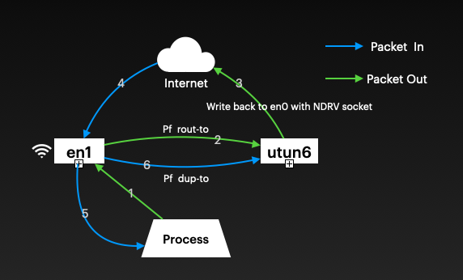

# opener  

A simple packet capture & redirect app. Network traffic is captured on primary netowrk interface, such as en0.  
Then it woruld be redirected to utun, so we can manipulate theses packets.  
In this project, I just simply write
packets back to en0 via the NDRV raw socket. It also capture packet passed in, and duplicate that to utun.

## PF rules
> set skip on utun6  
> pass out on en1 route-to utun6 inet all no state  
> pass in  on en1 dup-to utun6 inet all no state  

## Problems on Apple M1 macOS 12.0 

Not able to upload file which size bigger than 1Mb.  
because pf forward packet from en0 to utun6 really slow.  
Only 1 ~ 2 packets are sent per second.  
Download works fine, as ACK packet can be forward quickly.  
I have send a request "FB9752918" to Apple, hopes they'll take a look.

### How to reproduce this bug?  

**Method 1**
1. click the capture switch to capture all packets to utun
1. send an screenshot of your desktop or some reugular file to your contacts via IM

**Method 2** 

Open a process in the public cloud service to receive packets
>  nc  -l -p 1234 > file

Then, send a file to the cloud service
> nc {Server IP} 1234 < SAC.app.zip
